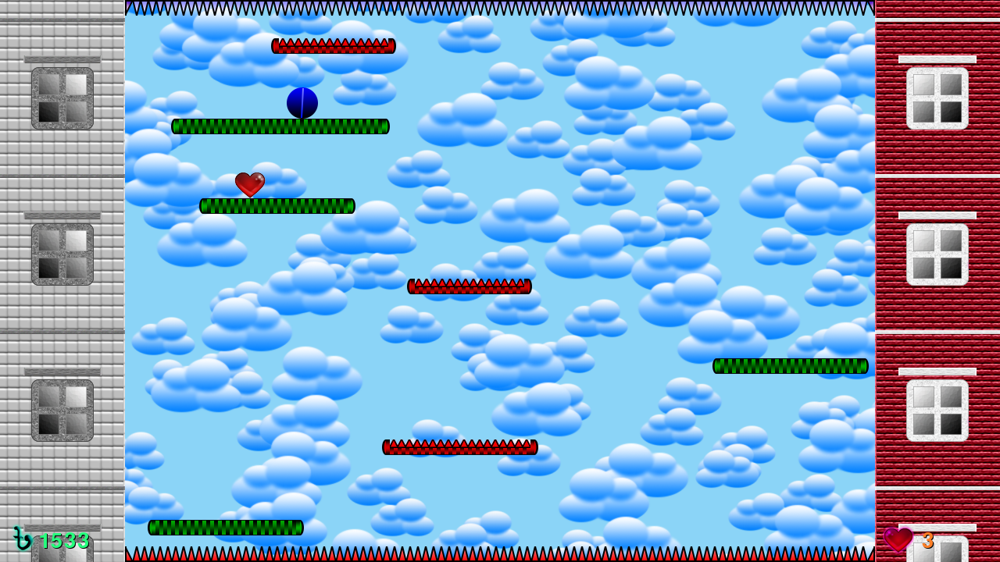

# Rapid-Roll-Lite
This game is the remake of the famous classic game *Rapid Roll* found in old Nokia phones. This remake will bring back nostalgia feelings!

## Play the game
This game has been created with **Python** and **Pygame**. It can run on Windows, Mac, Linux. To play the game, do the following (if not yet):
  - First download Python (version 3.6.1 or later) according to your computer's operating system and install it.
  - Then download and install Pygame using this command: `pip install pygame`

## Game control
This game is simple to control. It can be played with both mouse and keyboard.

## Screenshot
Here is a screenshot of this game:

## Video
Here is a gameplay video of this game (click to watch):

